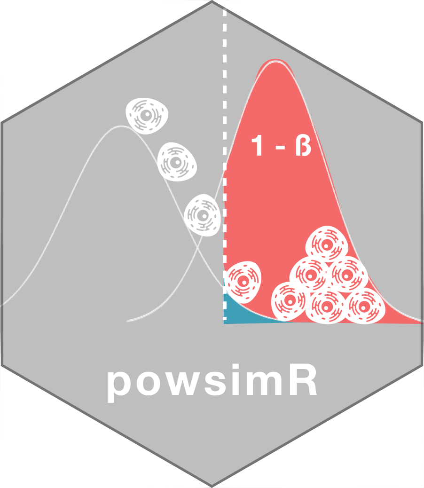

<!-- README.md is generated from README.Rmd. Please edit that file -->

```{r, echo = FALSE}
knitr::opts_chunk$set(
  collapse = TRUE,
  comment = "#>",
  fig.path = "README-"
)
```

# `powsimR` <br/> Power analysis for bulk and <br/> single cell RNA-seq experiments 

Please also consult my Github Page of [powsimR](https://bvieth.github.io/powsimR/) made with [pkgdown](http://pkgdown.r-lib.org/index.html)!

## :arrow_double_down: Installation Guide

For the installation, the R package `devtools` is needed.

```{r, echo=T, eval=F, tidy=T}
install.packages('devtools')
library(devtools)
```

I recommend to install first the dependencies manually and then powsimR. If you plan to use MAGIC for imputation, then please follow their [instruction](https://github.com/KrishnaswamyLab/MAGIC) to install the python implementation before installing powsimR.  

```{r, echo=T, eval=F, tidy=T}
ipak <- function(pkg, repository=c('CRAN', 'Bioconductor', 'github')){
  new.pkg <- pkg[!(pkg %in% installed.packages()[, "Package"])]
  # new.pkg <- pkg
  if (length(new.pkg)) {
    if(repository=='CRAN') {
      install.packages(new.pkg, dependencies = TRUE)
    }
    if(repository=='Bioconductor') {
      if(strsplit(version[['version.string']], ' ')[[1]][3] > "3.6.0"){
        if (!requireNamespace("BiocManager")){
            install.packages("BiocManager")
        }
            BiocManager::install(new.pkg, dependencies=TRUE, ask=FALSE)
      }
      if(strsplit(version[['version.string']], ' ')[[1]][3] < "3.6.0"){
        stop(message("powsimR depends on packages that are only available in R 3.6.0 and higher."))
      }
    }
    if(repository=='github') {
      devtools::install_github(new.pkg, build_vignettes = FALSE, force = FALSE, dependencies=TRUE)
    }
  }
}

# CRAN PACKAGES
cranpackages <- c("broom", "cobs", "cowplot", 
                  "data.table", "doParallel", "dplyr", "DrImpute", 
                  "fastICA", "fitdistrplus", "foreach", "future",
                  "gamlss.dist", "ggplot2", "ggpubr", "grDevices",
                  "grid", "Hmisc", "kernlab", "MASS", "magrittr", "MBESS", "Matrix",
                  "matrixStats", "mclust", "methods", "minpack.lm", "moments", "msir", 
                  "NBPSeq", "nonnest2", "parallel", "penalized", "plyr", "pscl",
                  "reshape2", "Rmagic", "rsvd", "Rtsne", "scales", "Seurat", "snow", "sctransform", 
                  "stats", "tibble", "tidyr", "truncnorm", "VGAM", "ZIM", "zoo")
ipak(cranpackages, repository='CRAN')

# BIOCONDUCTOR
biocpackages <- c("bayNorm", "baySeq", "BiocGenerics", "BiocParallel", 
                  "DEDS", "DESeq2", "EBSeq", "edgeR", "IHW", "iCOBRA",
                  "limma", "Linnorm", "MAST", "monocle", "NOISeq", "qvalue", "ROTS", "RUVSeq", 
                  "S4Vectors", "scater", "scDD", "scde", "scone", "scran", "SCnorm", 
                  "SingleCellExperiment", "SummarizedExperiment", "zinbwave")
ipak(biocpackages, repository='Bioconductor')

# GITHUB
githubpackages <- c('nghiavtr/BPSC', 'cz-ye/DECENT', 
                    'mohuangx/SAVER', 'statOmics/zingeR')
ipak(githubpackages, repository = 'github')


```

To check whether all dependencies are installed, you can run the following lines:

```{r depcheck, echo = TRUE, eval = FALSE, tidy = FALSE}

powsimRdeps <- data.frame(Package = c(cranpackages, 
                                      biocpackages, 
                                      sapply(strsplit(githubpackages, "/"), "[[", 2)), 
                          stringsAsFactors = F)

ip <- as.data.frame(installed.packages()[,c(1,3:4)], stringsAsFactors = F)

ip.check <- cbind(powsimRdeps, 
                  Version = ip[match(powsimRdeps$Package, rownames(ip)),"Version"]) 

table(is.na(ip.check$Version))  # all should be FALSE

```

After installing the dependencies, powsimR can be installed by using devtools as well.

```{r, echo=T, eval=F, tidy=T}
devtools::install_github('bvieth/powsimR', 
                         build_vignettes = TRUE, 
                         dependencies=FALSE)
library("powsimR")
```

Alternative, you can try to install powsimR and its dependencies directly using devtools:

```{r, echo=T, eval=F, tidy=T}
devtools::install_github("bvieth/powsimR")
```

## :book: User Guide

For examples and tips on using the package, please consult the vignette after successful installation by 

```{r, echo=T, eval=F, tidy=T}
browseVignettes('powsimR')
```

Some users have experienced issues installing powsimR due to vignette compilation errors. If that is the case, you can leave out building the vignette (by setting build_vignettes to FALSE) and read it on my Github Page of [powsimR](https://bvieth.github.io/powsimR/articles/powsimR.html) or download it as a html file [here](https://github.com/bvieth/powsimR/tree/master/inst/doc/powsimR.html).

### DLLs and ulimit

Note that the error "maximal number of DLLs reached..." might occur due to the loading of many shared objects by Bioconductor packages. Restarting the R session after installing dependencies / powsimR will help.
Starting with R version 3.4.0, one can set the environmental variable 'R_MAX_NUM_DLLS' to a higher number. See `?Startup()` for more information. I recommend to increase the maximum number of DLLs that can be loaded to 500. The environmental variable R\_MAX\_NUM\_DLLS can be set in R\_HOME/etc/Renviron prior to starting R. For that locate the Renviron file and add the following line: R\_MAX\_NUM\_DLLS=xy where xy is the number of DLLs.
On my Ubuntu machine, the Renviron file is in /usr/lib/R/etc/ and I can set it to 500.

In addition, the user limits for open files (unix: ulimit) might have to be set to a higher number to accomodate the increase in DLLs. Please check out the help pages for [MACs](https://gist.github.com/tombigel/d503800a282fcadbee14b537735d202c) and [Linux](https://glassonionblog.wordpress.com/2013/01/27/increase-ulimit-and-file-descriptors-limit/) for guidance.

## :scroll: Citation

Please use the following entry for citing powsimR.

```{r, echo=T, eval=F, tidy=T}
citation("powsimR")
```

powsimR is published in [Bioinformatics](https://doi.org/10.1093/bioinformatics/btx435). 
A preprint paper is also on [bioRxiv](https://doi.org/10.1101/117150). 

## :incoming_envelope:  Notes

Please send bug reports and feature requests by opening a new issue on 
[this page](https://github.com/bvieth/powsimR/issues).


## `R` Session Info

```{r}
library(powsimR)
sessionInfo()
```


