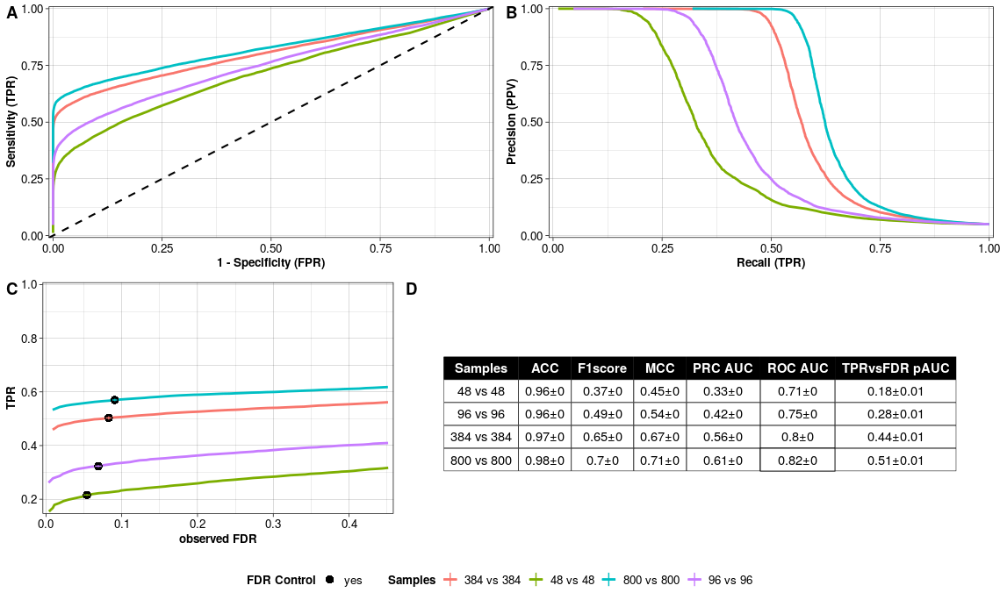
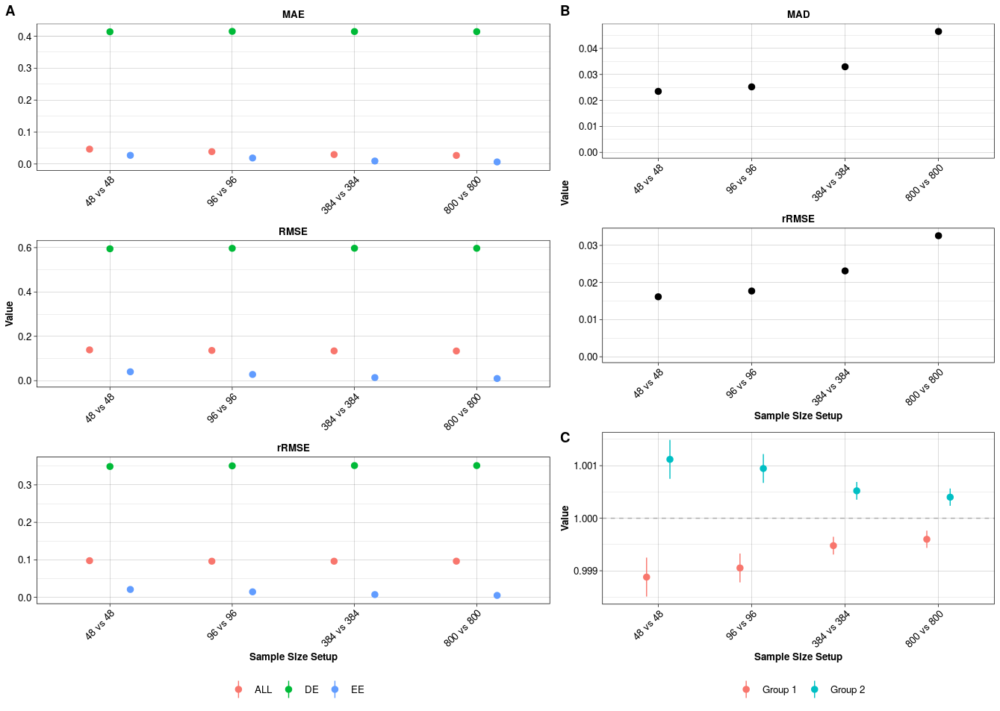

```{r knitr_init, echo=FALSE, results="asis", cache=FALSE}
library(knitr)
library(rmdformats)
## Global options
options(max.print = "75")
opts_chunk$set(echo = FALSE,
	             cache = FALSE,
               prompt = FALSE,
               tidy = FALSE,
               comment = NA,
               message = FALSE,
               warning = FALSE)
opts_knit$set(width = 75)
```

# Abstract {.unnumbered}

This vignette describes the R package `powsimR` [@Vieth2017-lh]. It aims to be at once a demonstration of its features and a guide to its usage. Statistical power analysis is essential to optimize the design of RNA-seq experiments and to assess and compare the power to detect differentially expressed genes in RNA-seq data. `powsimR` is a flexible tool to simulate and evaluate differential expression from bulk and especially single-cell RNA-seq data making it suitable for a priori and posterior power analyses. 

For our count simulations, we (1) reliably model the mean, dispersion and dropout distributions as well as the relationship between those factors from the data. (2) Simulate counts from the empirical mean-variance and dropout relations, while offering flexible choices of the number of differentially expressed genes, effect sizes, DE testing and normalisation method. (3) Finally, we evaluate the power over various sample sizes and visualise the results with error rates plots.

**Note:** if you use powsimR in published research, please cite:

> Vieth, B., Ziegenhain, C., Parekh, S., Enard, W. and Hellmann, I. (2017)
> powsimR: Power Analysis for Bulk and Single Cell RNA-Seq Experiments.
> *Bioinformatics*, **33(21)**:3486-88.
> [10.1093/bioinformatics/btx435](http://dx.doi.org/10.1093/bioinformatics/btx435)


# Installation Guide {.unnumbered}

For the installation, the R package `devtools` is needed.

```{r DevTools, echo = TRUE, eval = FALSE}
install.packages('devtools')
library(devtools)
```

`powsimR` has a number of dependencies that need to be installed before hand (see also the README file on github). I recommend to install first the dependencies manually and then powsimR. If you plan to use MAGIC for imputation, then please follow their [instruction](https://github.com/KrishnaswamyLab/MAGIC) to install the python implementation before installing powsimR.  

```{r dep, echo = TRUE, eval = FALSE}
ipak <- function(pkg, repository=c('CRAN', 'Bioconductor', 'github')){
  new.pkg <- pkg[!(pkg %in% installed.packages()[, "Package"])]
  # new.pkg <- pkg
  if (length(new.pkg)) {
    if(repository=='CRAN') {
      install.packages(new.pkg, dependencies = TRUE)
    }
    if(repository=='Bioconductor') {
      if(strsplit(version[['version.string']], ' ')[[1]][3] > "3.6.0"){
        if (!requireNamespace("BiocManager")){
            install.packages("BiocManager")
        }
            BiocManager::install(new.pkg, dependencies=TRUE, ask=FALSE)
      }
      if(strsplit(version[['version.string']], ' ')[[1]][3] < "3.6.0"){
        stop(message("powsimR depends on packages that are only available in R 3.6.0 and higher."))
      }
    }
    if(repository=='github') {
      devtools::install_github(new.pkg, build_vignettes = FALSE, force = FALSE, dependencies=TRUE)
    }
  }
}

# CRAN PACKAGES
cranpackages <- c("broom", "cobs", "cowplot", 
                  "data.table", "doParallel", "dplyr", "DrImpute", 
                  "fastICA", "fitdistrplus", "foreach", "future",
                  "gamlss.dist", "ggplot2", "ggpubr", "ggstance", "grDevices",
                  "grid", "Hmisc", "kernlab", "MASS", "magrittr", "MBESS", "Matrix",
                  "matrixStats", "mclust", "methods", "minpack.lm", "moments", "msir", 
                  "NBPSeq", "nonnest2", "parallel", "penalized", "plyr", "pscl",
                  "reshape2", "Rmagic", "rsvd", "Rtsne", "scales", "Seurat", "snow", "sctransform", 
                  "stats", "tibble", "tidyr", "truncnorm", "VGAM", "ZIM", "zoo")
ipak(cranpackages, repository='CRAN')

# BIOCONDUCTOR
biocpackages <- c("bayNorm", "baySeq", "BiocGenerics", "BiocParallel", 
                  "DESeq2", "EBSeq", "edgeR", "IHW", "iCOBRA",
                  "limma", "Linnorm", "MAST", "monocle", "NOISeq", "qvalue", "ROTS", "RUVSeq", 
                  "S4Vectors", "scater", "scDD", "scde", "scone", "scran", "SCnorm", 
                  "SingleCellExperiment", "SummarizedExperiment", "zinbwave")
ipak(biocpackages, repository='Bioconductor')

# GITHUB
githubpackages <- c('cz-ye/DECENT', 'nghiavtr/BPSC', 
                    'mohuangx/SAVER', 'statOmics/zingeR',
                    'Vivianstats/scImpute')
ipak(githubpackages, repository = 'github')

```

To check whether all dependencies are installed, you can run the following lines:

```{r depcheck, echo = TRUE, eval = FALSE}
powsimRdeps <- data.frame(Package = c(cranpackages, 
                                      biocpackages, 
                                      sapply(strsplit(githubpackages, "/"), "[[", 2)), 
                          stringsAsFactors = F)

ip <- as.data.frame(installed.packages()[,c(1,3:4)], stringsAsFactors = F)

ip.check <- cbind(powsimRdeps, 
                  Version = ip[match(powsimRdeps$Package, rownames(ip)),"Version"]) 

table(is.na(ip.check$Version))  # all should be FALSE
```

After installing the dependencies, powsimR can be installed by using devtools as well.

```{r install1, echo=T, eval=F, tidy=T}
devtools::install_github('bvieth/powsimR', 
                         build_vignettes = TRUE, 
                         dependencies=FALSE)
library("powsimR")
```

Some users have experienced issues installing powsimR due to vignette compilation errors. If that is the case, you can leave out building the vignette (by setting build_vignettes to FALSE).

Alternative, you can try to install powsimR and its dependencies directly using devtools:

```{r install2, echo=T, eval=F, tidy=T}
devtools::install_github("bvieth/powsimR")
```

# Introduction

In this vignette, we illustrate the features of `powsimR` by assessing the power to detect differential expression between two groups of mouse embryonic stem cells cultured in standard 2i/LIF culture medium [GSE75790](https://www.ncbi.nlm.nih.gov/geo/query/acc.cgi?acc=GSE75790) [@Ziegenhain2017-sf].

## powsimR Workflow

The basic workflow of `powsimR` is illustrated in Figure \@ref(fig:schematic): A) The mean-dispersion relationship is estimated from RNA-seq data, which can be either single cell or bulk data. The user can provide their own count table or a publicly available one and choose whether to fit a negative binomial or a zero-inflated negative binomial. The plot shows a representative example of the mean-dispersion relation estimated, assuming a negative binomial for the Ziegenhain data, the red line is the loess fit, that we later use for the simulations. B) These distribution parameters are then used to set up the simulations in which the user can freely choose the magnitude and amount of differential expression, the sample size configuration as well as the processing pipeline for DE-testing. C) Finally, the error rates are calculated. These can be either returned as marginal estimates per sample configuration, or stratified according to the estimates of mean expression, dispersion or dropout rate. Furthermore, the user can evaluate the analytical choices (e.g. imputation and normalisation).

```{r schematic, fig.cap="PowsimR schematic overview. We want to investigate the statistical power to detect differential expression in our RNA-seq experiment. Firstly, key expression characteristics of the RNA-seq data, which can be either single cell or bulk data. The plot shows the mean-dispersion estimated, the red line is the loess fit, that we later use for the simulations. The expression of spike-ins can also be modelled. Secondly, we define our desired simulation setup: the number and magnitude of differential expression, the sample size setup as well as the tools to use in our DE-Pipeline. Last, we evaluate the simulated experiment using the error rates of the confusion matrix. Particularly, the power (TPR) and false detection (FDR) are calculated per sample setup configuration.", echo=F, eval=T, include=T}
knitr::include_graphics("powsimr_workflow.png")
```

# Estimation {.tabset}

## Single Cell Gene Expression 

The parameters of the (zero-inflated) negative binomial distribution, i.e. mean and dispersion are estimated by the function `estimateParam`. In addition, the dropout probability, i.e. the fraction of zero counts per gene, is calculated.

It is very important to supply the count matrix of a RNA-seq experiment profiling one group of samples or cells only. For example, for bulk please provide the count matrix containing the expression of the untreated samples / wild type _ONLY_; for single cells please provide the count matrix containing the expression of one cell type sampled from one patient / mouse _ONLY_, e.g. the expression of monocytes from peripheral mononuclear blood (PBMC) extracted from one patient.

The user can choose between two estimation frameworks:

* Negative binomial distribution (NB)
* Zero-inflated negative binomial distribution (ZINB)

In both cases matching moments estimation of mean and dispersion are based on normalized counts.

The user can choose between multiple normalisation methods (see Details section of `estimateParam`). Furthermore, a number of methods are group sensitive (e.g. batch labels can be provided in SCnorm). For single cell data, it is important to filter out genes and/or cells that are outliers or deemed undetected (see options SampleFilter and GeneFilter).

The estimates, sequencing depth and normalisation factors are plotted with `plotParam`.

With the following command, we estimate and plot the parameters for the mouse embryonic stem cells profiled with CELseq2 [@Ziegenhain2017-sf] (Figure \@ref(fig:geneparamsplot)). Firstly, we can examine the quality of the data set using the metrics in Figure \@ref(fig:geneparamsplot) A. But most importantly, we see that the variability (i.e. dispersion) and dropout rates are high (Figure \@ref(fig:geneparamsplot) B). Furthermore, the dispersion depends on the mean and does not level off with higher mean values compared to bulk data  (Figure \@ref(fig:geneparamsplot) D).

```{r geneparams, echo=T, eval=F, include=T}
data("CELseq2_Gene_UMI_Counts")
batch <- sapply(strsplit(colnames(CELseq2_Gene_UMI_Counts), "_"), "[[", 1)
Batches <- data.frame(Batch = batch,
                      stringsAsFactors = FALSE, 
                      row.names = colnames(CELseq2_Gene_UMI_Counts))
data("GeneLengths_mm10")

# estimation
estparam_gene <- estimateParam(countData = CELseq2_Gene_UMI_Counts,
                          readData = NULL,
                          batchData = Batches,
                          spikeData = NULL,
                          spikeInfo = NULL,
                          Lengths = GeneLengths, MeanFragLengths = NULL,
                          RNAseq = 'singlecell', Protocol = 'UMI',
                          Distribution = 'NB', Normalisation = "scran",
                          GeneFilter = 0.1, SampleFilter = 3,
                          sigma = 1.96, NCores = NULL, verbose = TRUE)

# plotting
plotParam(estParamRes = estparam_gene, Annot = T)
```

```{r geneparamsplot, echo = FALSE, eval = TRUE, include = TRUE, fig.wide = TRUE, fig.cap="Estimated parameters for CEL-seq2 libraries from Ziegenhain et al. 2017. A) Quality Control Metrics: Sequencing depth; Library size factors with median (black line) for the filtered data set; Detected genes; Ratio of gene to spike-in counts (if spike-ins were provided). Outliers are marked in red. B) Marginal Distribution of gene mean, dispersion and dropout rate per estimation set. C) Number of genes and samples per estimation set. Provided by the user; Detected = number of genes and samples with at least one count; All = number of genes for which mean, dispersion and dropout could be estimated using non-outlying samples. \nFiltered = number of genes above filter threshold for which mean, dispersion and dropout could be estimated using non-outlying samples. Dropout Genes = number of genes filtered out due to dropout rate. D) Local polynomial regression fit between mean and dispersion estimates with variability band per gene (yellow). Common dispersion estimate (grey dashed line). E) Fraction of dropouts versus estimated mean expression per gene."}

```

We have implemented a count simulation framework assuming either a negative binomial distribution or a zero-inflated negative binomial distribution.
To predict the dispersion given a random draw of mean expression value observed, we apply a locally weighted polynomial regression fit (solid orange line in Figure \@ref(fig:geneparamsplot) D). To capture the variability of dispersion estimates observed, a local variability prediction band is applied (dashed orange lines in Figure \@ref(fig:geneparamsplot) D).

For bulk RNA-seq experiments, dropouts are less probable but can still occur. To include this phenomenon we sample from the observed dropout rates for genes that have a mean expression value below 5\% dropout probability determined by a decrease constrained B-splines regression of dropout rate against mean expression (`cobs`).

For the zero-inflated negative binomial distribution, the mean-dispersion relation is similarly estimated, but based on positive read counts. Furthermore, the dropouts are also predicted based on a locally weighted polynomial regression fit between mean and dropouts. Of note, this fit is done separately for amplified and non-amplified transcripts and similar proportions of genes as observed are also generated in the simulations [@Ziegenhain2017-sf].

We and others have found that the negative binomial (NB) distribution is particularly suited for scRNA-seq protocols with UMIs (e.g. SCRB-Seq, Drop-Seq, 10XGenomics) [@Svensson2020-ip] whereas non-UMI methods like Smartseq2 show a considerable proportion of genes with zero-inflated count distributions and the zero-inflated negative binomial (ZINB) is then more appropiate [@Vieth2017-lh]. In addition, we recommend the NB distribution for bulk RNA-seq and only recommend the option 'singlecell' in `estimateParam()` and specialised single cell tools for e.g. normalisation if the data is extremely sparse.

## Spike-Ins

Some normalisation methods can use spike-ins as part of their normalisation (e.g. SCnorm, scran, Census). We have found that using spike-ins when comparing expression across cells with strong asymmetric differences is important, e.g. comparing resting cells to very transcriptionally active cells [@Vieth2019-ld]. To use spike-in information in the simulations, their distributional characteristics need to be estimated. We follow the estimation and simulation framework presented in [@Kim2015-zo] where the variance is decomposed into shot noise and mRNA loss due to capture and sequencing efficiency. In short, the parameters for a Beta-distribution describes the RNA molecule capture efficiency and the parameters of a Gamma distribution describes the sequencing efficiency, which we can then use to simulate in silico spike-ins given a mean expression value. We assume that biological variance does not contribute to spike-in expression.

The user needs to define the spike-in expression table and the spike-in information table (IDs, molecules, lengths per spike-in) in the function `estimateSpike`.

The following formula can help the user to calculate the number of molecules of spike-ins:

\begin{equation}
    Y_{j} = c_{j} * V * 10^{-3} * D^{-1} * 10^{-18} * {Avogadro}, \quad j=1,\dots,92
\end{equation}

The number of molecules $Y_{j}$ for each ERCC spike-in species is the product of the molar concentration $c_{j}$ (attomoles per microlitre), the dilution factor $1/D$, the volume $V$ (nanolitre), Avogadros' constant ($6.02214129*10^{23}$) and conversion factors between unit scales.

With the following command, we estimate the parameters for the spike-ins added during library preparation of mouse embryonic stem cells cultured in standard 2i+lif medium [@Ziegenhain2017-sf]. Descriptive plots of the spike-ins can be drawn with `plotSpike` (Figure \@ref(fig:spikeplot)).

```{r spikeparams, echo=T, eval=F, include=T, warning=F}
data("CELseq2_SpikeIns_UMI_Counts")
data("CELseq2_SpikeInfo")
batch = sapply(strsplit(colnames(CELseq2_SpikeIns_UMI_Counts), "_"), "[[", 1)
Batches = data.frame(Batch = batch,
                       stringsAsFactors = F,
                       row.names = colnames(CELseq2_SpikeIns_UMI_Counts))
# estimation
estparam_spike <- estimateSpike(spikeData = CELseq2_SpikeIns_UMI_Counts,
spikeInfo = CELseq2_SpikeInfo,
MeanFragLength = NULL,
batchData = Batches,
Normalisation = 'depth')

# plotting
plotSpike(estparam_spike)

```

```{r spikeplot, echo=F, warning=F, eval=T, include=T, fig.height = 7, fig.width=10, fig.align='centered', fig.cap="Estimated parameters for the spike-ins added to CEL-seq2 libraries in Ziegenhain et al. 2017 (A) Sequencing depth per sample with median sequencing depth (grey dashed line). (B) Library size normalisation factor per sample with median size factor (grey dashed line). (C) Calibration curve with mean expression estimates and average R squared over all cells. (D) Capture efficiency with binomial logistic regression fit over all cells."}
knitr::include_graphics("estparam_spike_celseq2.png")
```


# Simulation {.tabset}

## Setup

For simulating differential expression between two groups, the number of genes, number of simulations, percentage of differential expression and effect size are set up with the function `Setup`. The effect size is here defined as the log fold change which can be a constant (e.g. 2), sampled from a vector of anticipated log fold changes (e.g. derived from pilot experiments) or a function. The uniform, normal and gamma distributions are possible options and illustrated in figure \@ref(fig:lfcs). Depending on the settings, these distribution can be broader or narrower. If using this option, we recommend to choose a distribution that closely resembles previously observed or expected fold changes. 
There is also the possibility to include batch effects, see the Details section in `Setup()`.

```{r lfcs, echo=F, eval=T, include=T, fig.cap="Examples of Log Fold Changes following a gamma, normal and uniform distribution."}
knitr::include_graphics("lfcdist.png")
```

The number of replicates per group (n1 and n2) are also defined in `Setup` which can be unbalanced. In addition the user can choose to include the simulation of dropout genes so that the resulting count matrix has a percentage of dropouts equal to the rate filtered out during estimation.

The distribution estimates and these settings are then combined into one object.

The following command sets up simulations with 10,000 genes, 5\% genes being DE, log fold change sample from a narrow gamma distribution and parameter estimates based on CEL-seq2 libraries in Ziegenhain dataset. The spike-ins are only necessary if we wish to apply imputation, normalisation and/or DE-tools that can utilize spike-ins, see the Details section of `estimateParam()` and `simulateDE()`.

```{r simsetup, echo = TRUE, eval = FALSE}
# define log fold change
p.lfc <- function(x) sample(c(-1,1), size=x,replace=T)*rgamma(x, shape = 1, rate = 2)
# set up simulations
setupres <- Setup(ngenes = 10000, nsims = 25,
                  p.DE = 0.05, pLFC = p.lfc,
                  n1 = c(48, 96, 384, 800), n2 = c(48, 96, 384, 800),
                  Thinning = NULL, LibSize = 'equal',
                  estParamRes = estparam_gene,
                  estSpikeRes = NULL,
                  DropGenes = TRUE,
                  setup.seed = 5299, verbose = TRUE)

```

## Running differential expression simulations

With the setup defined, the differential expression simulation is run with `simulateDE`. For this, the user needs to set the following options:

* **DEmethod:** The differential testing method. The user can choose between 20 methods in total. 10 developed for bulk, 9 developed for single cells (see the Details section of `simulateDE`).
* **Normalisation:** The normalisation method. The user can choose between 10 methods in total. 5 developed for bulk, 5 developed for single cells (see the Details section of `simulateDE`).

There are also additional options: Whether to apply a prefiltering or imputation step prior to normalisation; whether spike-in information should be used (if available). For more information, please consult the Details section of `simulateDE`.

``` {r simrun, eval=F, echo=T}
simres <- simulateDE(SetupRes = setupres,
                     Prefilter = NULL, Imputation = NULL,
                     Normalisation = 'scran',
                     DEmethod = "limma-trend", DEFilter = FALSE,
                     NCores = NULL, verbose = TRUE)
```


# Evaluation {.tabset}

The results of the simulations can now be evaluated. Primarily the differential expression in terms of power can be examined with `evaluateDE` and `evaluateROC`. In addition, we can also check in how far our chosen pipeline tools perform in terms of log fold change estimates and normalisation with `evaluateSim`. 

## Differential Expression

The results of differential expression simulation are evaluated with `evaluateDE`. We have separated the evaluation from DE detection to allow the user to evaluate power in a comprehensive way as advocated by [@Wu2015-uj].
In this function, the proportions and error rates are estimated. The rates can be stratified by mean, dispersion, dropout or log fold change. Furthermore, the user can choose between different multiple testing correction methods (see `p.adjust.methods()`, `ihw()` in `r library("IHW")` and `qvalue()` in `r library("qvalue")`). Also, the genes can be filtered by mean, dispersion or dropout. To define biologically interesting genes, a cutoff for the log fold change with `delta` can be set.

With the following command we evaluate the marginal TPR and FDR conditional on the mean expression: 

```{r evalderes, echo = T, eval=F}
evalderes = evaluateDE(simRes = simres,
                     alpha.type = 'adjusted',
                     MTC = 'BH',
                     alpha.nominal = 0.1,
                     stratify.by = 'mean',
                     filter.by = 'none',
                     strata.filtered = 1,
                     target.by = 'lfc',
                     delta = 0)
```

The results of the evaluation can be plotted with `plotEvalDE()`.

```{r, echo = TRUE, eval = FALSE}
plotEvalDE(evalRes = evalderes, rate = 'marginal', quick = TRUE, Annot = TRUE)
plotEvalDE(evalRes = evalderes, rate = 'conditional', quick = TRUE, Annot = TRUE)

```

* **rate:** The user can choose to plot the 'marginal' or 'stratified' error rates. The number of genes per stratum are also summarised.
* **quick:** If this is set to `TRUE` then only the TPR and FDR will be plotted.

The quick marginal and conditional power assessment for the Ziegenhain data is plotted in Figure \@ref(fig:evaldeplot1) and \@ref(fig:evaldeplot2). As expected the power (TPR) to detect differential expression increases with sample size (Figure \@ref(fig:evaldeplot1)). On the other hand, the ability to control the false detection (FDR) at the chosen nominal level depends on the average expression of DE genes (Figure \@ref(fig:evaldeplot2)). Furthermore, the detection of true positives with small mean expression needs far more replicates per group.

```{r evaldeplot1, echo=F, eval=T, fig.cap="Marginal Error Rates. (A) Marginal FDR and TPR per sample size comparison. (B) Marginal FDR and TPR per sample size comparison with dashed line indicating nominal alpha level (type I error) and nominal 1-beta level, i.e. 80% power (type II error)."}

```

```{r evaldeplot2, echo=F, eval=T, fig.cap="Stratified Error Rates. (A) Conditional FDR and TPR per sample size comparison per stratum. (B) Number of equally (EE) and differentially expressed (DE) genes per stratum."}

```

In addition to the classical evaluation of power analyses, `powsimR` also includes the option to evaluate the simulations using summary metrics such as the Receiver-Operator-Characteristic (ROC) Curve as well as accuracy, F1 score and Matthews Correlation Coefficient. 

With the following command we calculate these metrics with `evaluateROC()` and plot them with `plotEvalROC()`. The classical ROC curve as well as precision-recall curve, which is more appropiate for imbalanced number of true positives and negatives, can be helpful to identify the optimal sample size setup (Figure \@ref(fig:evalrocresplot) A and B). Most importantly, we can check if the FDR is controlled at the chosen nominal level (Figure \@ref(fig:evalrocresplot) C). If that is not the case, then the chosen pipeline, particularly the normalisation and DE testing, might be an issue [@Vieth2019-ld].

```{r evalrocres, echo = T, eval=F}
evalrocres = evaluateROC(simRes = simres,
                         alpha.type="adjusted",
                         MTC='BH',
                         alpha.nominal = 0.1)

plotEvalROC(evalRes = evalrocres, cutoff = "liberal")
```

```{r evalrocresplot, echo=F, eval=T, fig.cap="A) Receiver-Operator-Characteristics (ROC) Curve per sample size setup. \nB) Precision-Recall (PR) Curve per sample size setup. \nC) TPR versus observed FDR per sample size setup. The filling of the point indicates whether FDR is controlled at the chosen nominal level. \nD) Summary Statistics per sample size setup rounded to two digits."}

```

## Pipeline

We can also check in how far our pipeline choices are affecting our ability to correctly identify differential expression in `evaluateSim()`. 

With the following command we calculate these metrics. Of note here is particular in how far our estimated log fold changes deviate from the simulated fold changes as well as how the normalisation is able to ensure comparability across sample groups (Figure \@(fig:evalsimresplot)).

```{r evalsimres, echo = T, eval=F}
evalsimres = evaluateSim(simRes = simres)

plotEvalSim(evalRes = evalsimres)

plotTime(evalRes = evalsimres)

```

```{r evalsimresplot, echo=F, eval=T, fig.cap="Pipeline Evaluation. A) Mean Absolute Error (MAE), Root Mean Squared Error (RMSE) and robust Root Mean Squared Error (rRMSE) for the estimated log fold changes of all (ALL), differentially expressed (DE) and equally expressed (EE) genes compared to the true log fold changes. \nB) Median absolute deviation (MAD) and robust Root Mean Squared Error (rRMSE) between estimated and simulated size factors. \nC) The average ratio between simulated and estimated size factors in the two groups per sample size setup. All values are mean +/- standard error."}

```

```{r evaltimeplot, echo=F, eval=T, fig.cap="Computational Run Time in seconds per simulateDE() pipeline step."}
knitr::include_graphics("evaltime_celseq2.png")
```

# Additional Functionalities {.tabset}

## Estimation

### Count matrices of single cell RNA-seq experiments

We have uploaded count matrices of 5 single cell RNA-seq experiments on [github](https://github.com/bvieth/powsimRData). In `powsimR`, we have included subsampled versions of these data sets, see description on the help page `GeneCounts`.
The user can calculate the negative binomial parameters with `estimateParam()`, view these estimates with `plotParam()` and use it as an input for simulations.

### Access to raw read counts stored in online data bases

We have provided a number of exemplary single cell RNA-seq data sets for parameter estimation. Nevertheless, you might not find a data set that matches your own experimental setup. In those cases, we recommend to check online repositories for a suitable data set. Below you can find an example script to get count tables from [recount2](https://jhubiostatistics.shinyapps.io/recount/) [@Collado-Torres2017-mo]. For a single cell RNA-seq data base, see [conquer](http://imlspenticton.uzh.ch:3838/conquer/) [@Soneson2018-xe].

As before, the user can then estimate the negative binomial parameters with `estimateParam()`, view these estimates with `plotParam()` and use it as an input for `Setup()`.

```{r online_repos, echo = T, eval = F}
# Install and load the R package
BiocManager::install("recount")
library('recount')

# Download the data set
url <- download_study('SRP060416')

# Load the data
load(file.path('SRP060416', 'rse_gene.Rdata'))

# count table
cnts <- assay(rse_gene)
# sample annotation
sample.info <- data.frame(colData(rse_gene)@listData, 
                          stringsAsFactors=F)
# gene annotation
gene.info <- data.frame(GeneID=rowData(rse_gene)@listData$gene_id, 
                        GeneLength=rowData(rse_gene)@listData$bp_length, 
                        stringsAsFactors=F)
```

## What is the best fitting distribution for my data?

It is important to validate the appropriateness of the chosen simulation framework. The function `evaluateDist()` compares the theoretical fit of the Poisson, negative binomial, zero-inflated Poisson and zero-inflated negative binomial and beta-Poisson distribution to the empirical RNA-seq read counts ([@Colin_Cameron2013-vb], [@Kim2013-qo], [@Delmans2016-ef]).

The evaluation is then plotted with the function `plotEvalDist()` which summarizes the best fitting distribution per gene based on goodness-of-fit statistics (Chi-square test), Akaike Information Criterium, comparing observed dropouts with zero count prediction of the models and comparing the model fitness with Likelihood Ratio Test and Vuong Test.

As noted by other developers, goodness-of-fit tests are not an objective tool and heavily depend on sample sizes [@Delignette-Muller2015-ie]. A graphical evaluation of the fitted distribution is considered the most appropriate way but for high-throughput sequencing this is an unrealistic recommendation.
Bulk RNA-seq experiments are usually conducted with a small number of samples. We therefore recommend to rely on the goodness-of-fit validation by [@Mi2015-ri]. 

With the following command, we determine and plot the fitting for the embryonic stem cells cultured in standard 2i+lif medium profiled with the Smartseq2 protocol [@Ziegenhain2017-sf]. Note that the results shown in Figure \@ref(fig:evaldistplot) will differ from the executed command since I reduced the data set and evaluate the fitting only for a fraction of genes. 

``` {r evaldist, eval=F, echo=T}
data("SmartSeq2_Gene_Read_Counts")
evalDistRes <- evaluateDist(countData = SmartSeq2_Gene_Read_Counts, 
                            batchData = NULL,
                            spikeData = NULL, spikeInfo = NULL,
                            Lengths = NULL, MeanFragLengths = NULL,
                            RNAseq = "singlecell", Protocol = "UMI",
                            Normalisation = "scran",
                            GeneFilter = 0.1, SampleFilter = 3,
                            FracGenes = 0.1,
                            verbose = TRUE)
plotEvalDist(evalDistRes)
```

```{r evaldistplot, echo=F, eval=T, include=T, fig.wide = TRUE, fig.cap="Distribution Evaluation. A) Goodness-of-fit of the model assessed with a Chi-Square Test based on residual deviance and degrees of freedom. B) Akaike Information Criterion per gene: Model with the lowest AIC. Model with the lowest AIC and passed goodness-of-fit statistic test.  C) Observed versus predicted dropouts per model and gene plotted without outliers. D) Model Assessment based on LRT for nested models and Vuong test for nonnested models."}
knitr::include_graphics("evaldist_smartseq2.png")
```

## Simulation Settings

### Phenotypic differences only in a subset of replicates

By default, all replicates per group express the phenotypic differences in gene expression defined by `pLFC`. If the user wishes for a more varied expression profile, i.e. only a proportion of replicates per group with a difference in expression, these patterns can be defined by changing `p.G` (see Details section of `Setup()`). 

### Include differences in library sizes

By default, there is no difference in library sizes between the samples. If the user wishes for a more realistic, i.e. more variable distribution of read counts across samples, the library sizes can be sampled from observed, vector or function (see Details section of `Setup()`).

### Downsample simulated count matrices by binomial thinning

There is the additional option to downsample simulated count matrices with the option `Thinning` in `Setup()` in order to know in how far a shallower sequencing depth affects the power to detect differential expression. For example, the estimation was done using 500 cells and in the simulations we would like to compare two groups with a total of 1000 cells but do not want to increase the sequencing depth compared to the pilot data. Thus we can set the Thinning parameters to 0.5 to half the number of counts per cell. Please note, that the thinning assumes that the count matrix is based on reads, not UMIs. For UMI-methods, please supply the UMI count matrix as `countData` in `estimateParam()` and the raw read count matrix without UMI deduplication as `readData`. For more information, please check out the help page of `estimateParam()`.

Below you can find an example script using the CELSeq2 libraries from Ziegenhain et al.:

```{r thinning, echo = TRUE, eval = FALSE}
data("CELseq2_Gene_UMI_Counts")
data("CELseq2_Gene_Read_Counts")
batch <- sapply(strsplit(colnames(CELseq2_Gene_UMI_Counts), "_"), "[[", 1)
Batches <- data.frame(Batch = batch,
                      stringsAsFactors = FALSE, 
                      row.names = colnames(CELseq2_Gene_UMI_Counts))
data("GeneLengths_mm10")

# estimation
estparam_gene <- estimateParam(countData = CELseq2_Gene_UMI_Counts,
                               readData = CELseq2_Gene_Read_Counts,
                               batchData = Batches,
                               spikeData = NULL,
                               spikeInfo = NULL,
                               Lengths = GeneLengths, MeanFragLengths = NULL,
                               RNAseq = 'singlecell', Protocol = 'UMI',
                               Distribution = 'NB', Normalisation = "scran",
                               GeneFilter = 0.1, SampleFilter = 3,
                               sigma = 1.96, NCores = NULL, verbose = TRUE)

plotParam(estParamRes = estparam_gene)

# define log fold change
p.lfc <- function(x) sample(c(-1,1), size=x,replace=T)*rgamma(x, shape = 1, rate = 2)

# set up simulations
setupres <- Setup(ngenes = 10000, nsims = 25,
                  p.DE = 0.1, pLFC = p.lfc,
                  n1 = c(500, 1000), n2 = c(500, 1000),
                  Thinning = c(1, 0.5), LibSize = 'given',
                  estParamRes = estparam_gene,
                  estSpikeRes = NULL,
                  DropGenes = TRUE,
                  setup.seed = 5299, verbose = TRUE)

# run simulations
simres <- simulateDE(SetupRes = setupres,
                     Prefilter = "FreqFilter", Imputation = NULL,
                     Normalisation = 'scran',
                     DEmethod = "limma-trend", DEFilter = FALSE,
                     NCores = NULL, verbose = TRUE)
```


# Session info {.unnumbered}

Here is the output of `sessionInfo()` on the system on which this
document was compiled:

```{r sessionInfo, echo=FALSE}
sessionInfo()
```


# References {.unnumbered}
